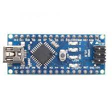
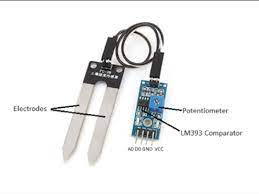
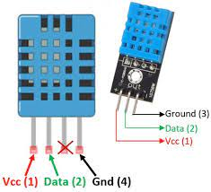
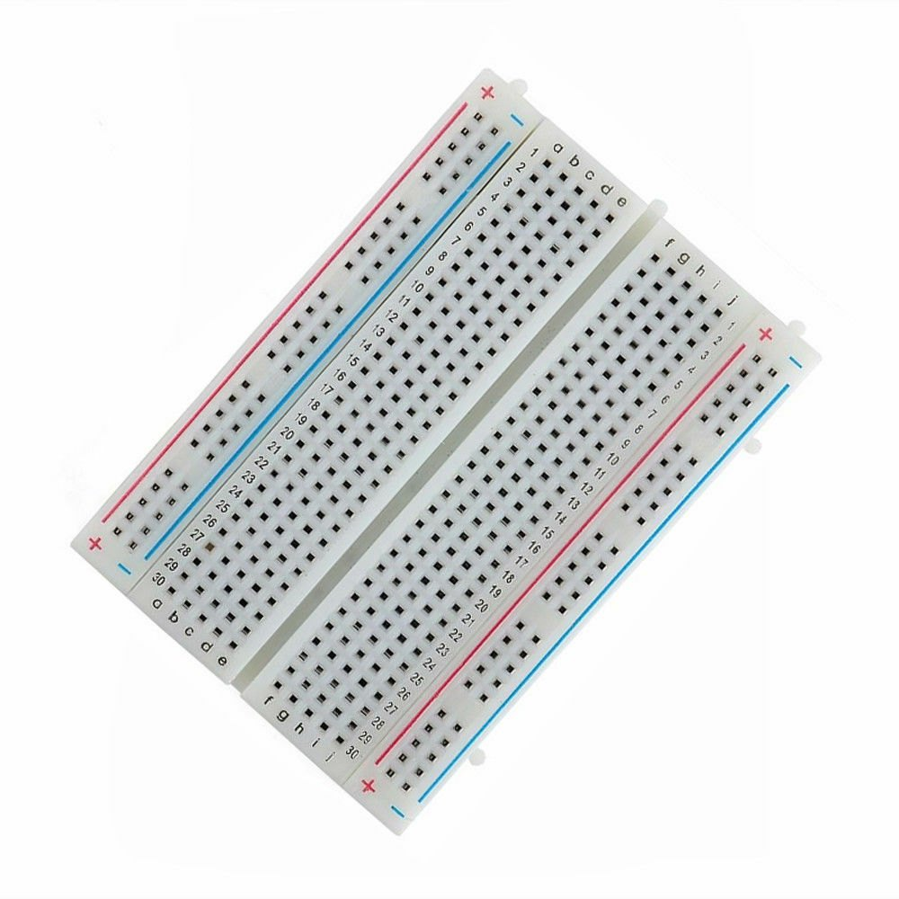
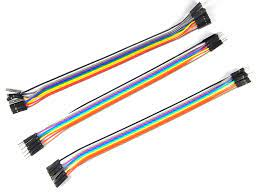

# Soil Moisture Detector

This is `Soil and Temperature Detector` which uses Arduino Nano, Soil Moisture Sensor Module, DHT11 Sensor, Breadboard and Jumper Wires.

## Working of each component :

1. Arduino Uno:
    
    This is the micro-controller and main processing unit of the system. It main controls input from the DHT11 sensor and Soil Moisture Sensor Module and displays on Serial Monitor.

2. Soil Moisture Sensor Module:
    
    It helps in detecting moisture of the soil in the form of numbers.

4. DHT11 Sensor:
    
    It helps in detecting moisture and temperature of the surroundings.

5. Breadboard:
    
    It helps in connecting various units without soldering.

6. Jumper Wires:
    
    It acts as connecting wires.

## Setup :

> ### Connections:
> - With the help of breadboard and jumper wires, connect VCC of DHT11 Sensor and Soil Moisture Sensor Module to 5V pin of Arduino Uno.
> - Similarly, With the help of breadboard and jumper wires, connect GND (ground) of DHT11 Sensor and Soil Moisture Sensor Module to GND (ground) pin of Arduino Uno.
> - Connect the A0 pin of Soil Moisture Sensor Module to A0 pin of Arduino Nano.
> - Connect the Data pin of DHT11 Sensor to A5 pin of Arduino Nano.

> ### Upload Code:
> - Clone this repository into your system.
> - Open Arduino IDE and open the file `soil_mosture_detector.ino` present in this repository.
> - Go to Tools > Board > Arduino AVR Boards and select Arduino Nano
> - Go to Tools > Port and select the port your Arduino Nano is connected with. You can find that in Device Manager of your system.
> - After the Arduino Nano is connected, Upload the code.
 
> #### Error:
> If an error persists, try removing all connections with arduino nano then uploading code and then again attaching all connections.

## Working :
> - Let the Arduino Nano connected to the laptop for power supply. You can also use an adapter if you want.
> - In the Arduino IDE, go to Serial Monitor (on the top right corner) and select baud length as 9600.
> You should be able to see the output there.

##### Note :
> You can also use LCD Display for impovised display of result.